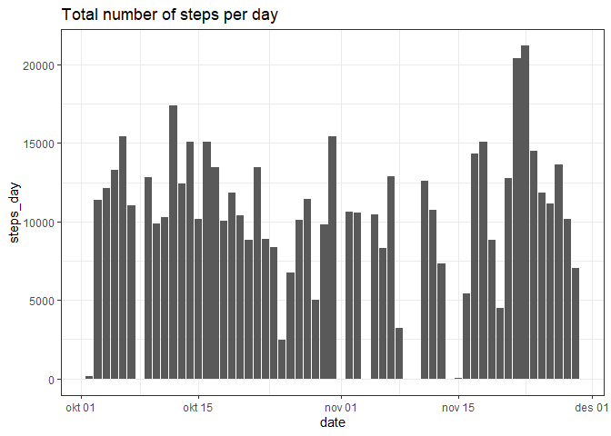
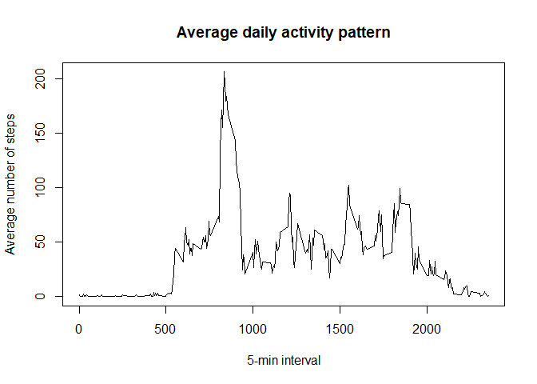
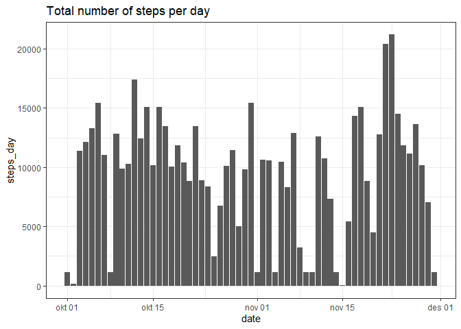
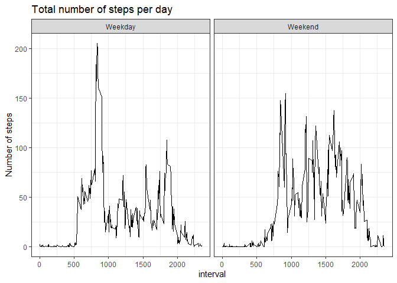

## Loading and preprocessing the data

In this section I unzip the data from the repository, load the data into R and transform the date variable to date format.


```r
unzip("activity.zip")
dat <- read.csv("activity.csv")

dat <- dat %>%
  mutate(date=as.Date(date))
```


## What is mean total number of steps taken per day?


```r
dat_day <- dat %>%
  filter(!is.na(steps)) %>%
  group_by(date) %>%
  summarise(steps_day=sum(steps))


g <- ggplot(dat_day, aes(x=date, y=steps_day))
g+geom_col()+theme_bw()+labs(title="Total number of steps per day")
```

<!-- -->

```r
summary(dat_day)
```

```
##       date              steps_day    
##  Min.   :2012-10-02   Min.   :   41  
##  1st Qu.:2012-10-16   1st Qu.: 8841  
##  Median :2012-10-29   Median :10765  
##  Mean   :2012-10-30   Mean   :10766  
##  3rd Qu.:2012-11-16   3rd Qu.:13294  
##  Max.   :2012-11-29   Max.   :21194
```

```r
mean <- mean(dat_day$steps_day)
median <- median(dat_day$steps_day)
```

* The mean total number of steps taken per day is 1.0766189\times 10^{4}
* The median total number of steps taken per day is 10765

## What is the average daily activity pattern?


```r
dat_int <- dat %>%
  filter(!is.na(steps)) %>%
  group_by(interval) %>%
  summarise(steps_int=mean(steps),
            steps_med=median(steps))

plot(dat_int$interval, dat_int$steps_int, type="l", xlab="5-min interval", ylab="Average number of steps", main="Average daily activity pattern")
```

<!-- -->

```r
dat_int$interval[dat_int$interval==max(dat_int$steps_int)]
```

```
## integer(0)
```

## Imputing missing values

### Total number of missing values


```r
nas <- nrow(dat[is.na(dat$steps),])
```
Total number of rows with NAs is 2304.

### Fill in missing values

I use the median for the 5 minute interval to fill in missing values.


```r
dat_fill <- dat %>%
  merge(dat_int, by="interval", all.x=TRUE) %>%
  mutate(steps=ifelse(is.na(steps), steps_med, steps))
```


```r
dat_day_upd <- dat_fill %>%
  filter(!is.na(steps)) %>%
  group_by(date) %>%
  summarise(steps_day=sum(steps))

g <- ggplot(dat_day_upd, aes(x=date, y=steps_day))
g+geom_col()+theme_bw()+labs(title="Total number of steps per day")
```

<!-- -->

```r
mean_upd <- mean(dat_day_upd$steps_day)
median_upd <- median(dat_day$steps_day)
```
After inputing missing data with the median value, the updated mean and median are:

* The mean total number of steps taken per day is 9503.8688525 instead of 1.0766189\times 10^{4}.
* The median total number of steps taken per day is 10765 instead of 10765.

The mean is lower after inputing missing values, while the median stays the same. This is obvious as I used the median to fill inn, and the median is therefore unaffected. The median value is lower than the mean, and has therefore reduced the new mean value. 


## Are there differences in activity patterns between weekdays and weekends?


```r
weekdays_dat <- dat_fill %>%
  mutate(wd=weekdays(date),
         wd=ifelse(wd=="lørdag", "Weekend", ifelse(wd=="søndag", "Weekend", "Weekday"))) %>%
  group_by(wd, interval) %>%
  summarise(m=mean(steps))
```

```
## `summarise()` has grouped output by 'wd'. You can override using the `.groups` argument.
```

```r
g_wd <- ggplot(weekdays_dat, aes(x=interval, y=m))
g_wd+geom_line()+theme_bw()+labs(title="Total number of steps per day",y="Number of steps")+facet_wrap(~wd)
```

<!-- -->

On weekdays, activity tends to start earlier in the day, but stay on a lower level throughout the day. In the weekends activity starts later in the morning, but is on a higher level mid-day. 
